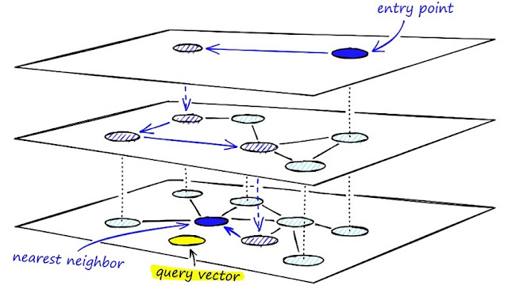
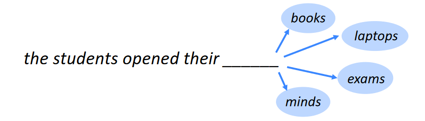

# PorraMatias_PLN

El repositorio "PorraMatias_PLN" contiene una colección de proyectos finales del programa de Especialización en Inteligencia Artificial en UBA. Estos proyectos abarcan diversas áreas de inteligencia artificial y demuestran aplicaciones prácticas. Incluyen tareas como procesamiento de lenguaje natural, vectorización, construcción de chatbots, generación de embeddings de palabras, clasificación de texto y modelado de secuencia a secuencia. Cada proyecto presenta una solución implementada en Python utilizando bibliotecas como TensorFlow, Gensim, numpy y pandas. Los enlaces a Colab permiten explorar cada proyecto en detalle. En resumen, estos proyectos brindan una visión general de las aplicaciones y técnicas clave en el campo de la inteligencia artificial.

## TP1 Vectorización
\
El script realiza procesamiento de lenguaje natural y vectorización utilizando numpy, pandas y otras bibliotecas. Define funciones para obtener representaciones de documentos y calcular la similitud entre vectores.\
Colab: [Vectorización](https://github.com/mporra93/PorraMatias_PLN/blob/main/TP1-Vectorizacion.ipynb)

## TP2 Bot Respuestas con predefinidas
\
El código crea un chatbot personalizado utilizando TensorFlow y procesamiento de lenguaje natural. Preprocesa y tokeniza datos de texto, y entrena un modelo de red neuronal para el chatbot.\
Colab: [Bot Respuestas con predefinidas](https://github.com/mporra93/PorraMatias_PLN/blob/main/TP2-Robot-ejercicio.ipynb)

## TP3 Embeddings
\
Este código crea vectores de palabras utilizando Gensim basado en un conjunto de datos dado. Preprocesa los datos, entrena un modelo Word2Vec, explora similitudes de palabras y visualiza los embeddings. Se extraen conclusiones de las similitudes y diferencias entre palabras en el espacio de embeddings.\
Colab: [Embeddings](https://github.com/mporra93/PorraMatias_PLN/blob/main/TP3-Embeddings.ipynb)

## TP4 Prediccion de Palabras
\
Este fragmento de código realiza varias tareas. Comienza importando bibliotecas necesarias y define funciones para entrenar un modelo de lenguaje utilizando redes neuronales LSTM. Toma como entrada un conjunto de datos que contiene código Python y aplica técnicas de preprocesamiento, como la tokenización, para convertir el texto en secuencias de tokens. Prepara las secuencias para entrenar el modelo de lenguaje. El modelo se entrena y se evalúa su rendimiento. Permite generar nuevas secuencias de código basadas en secuencias de entrada.\
Colab: [Prediccion de Palabras](https://github.com/mporra93/PorraMatias_PLN/blob/main/TP4-PrediccionDePalabras.ipynb)

## TP5 Ecomerce review ropa
\
Este código realiza una tarea de clasificación de texto utilizando un conjunto de datos de reseñas de ropa en eCommerce. Importa bibliotecas necesarias como numpy, pandas y TensorFlow. Descarga y carga el conjunto de datos en un DataFrame de pandas. Limpia los datos y visualiza la distribución de las calificaciones. Procesa las reseñas tokenizando las palabras, convirtiéndolas en secuencias de números y aplicando padding. Entrena un modelo utilizando embeddings de vectores de palabras FastText y una capa LSTM. Evalúa el modelo en un conjunto de prueba.\
Colab: [Ecomerce review ropa](https://github.com/mporra93/PorraMatias_PLN/blob/main/TP5-Clothing_ecommerce_reviews.ipynb)

## TP6 BOT QA
\
El código es una herramienta completa para el procesamiento de lenguaje natural y el modelado de secuencia a secuencia. Preprocesa conjuntos de datos, genera embeddings de palabras y construye un modelo codificador-decodificador utilizando capas LSTM. Permite realizar diversas tareas en el procesamiento de lenguaje natural.\
Colab: [BOT QA](https://github.com/mporra93/PorraMatias_PLN/blob/main/TP6-BOT%20QA.ipynb)

# Gracias!
Feel free to contact me by mail mporra.ie@gmail.com for any doubt.\
Enjoy :smile:!!
